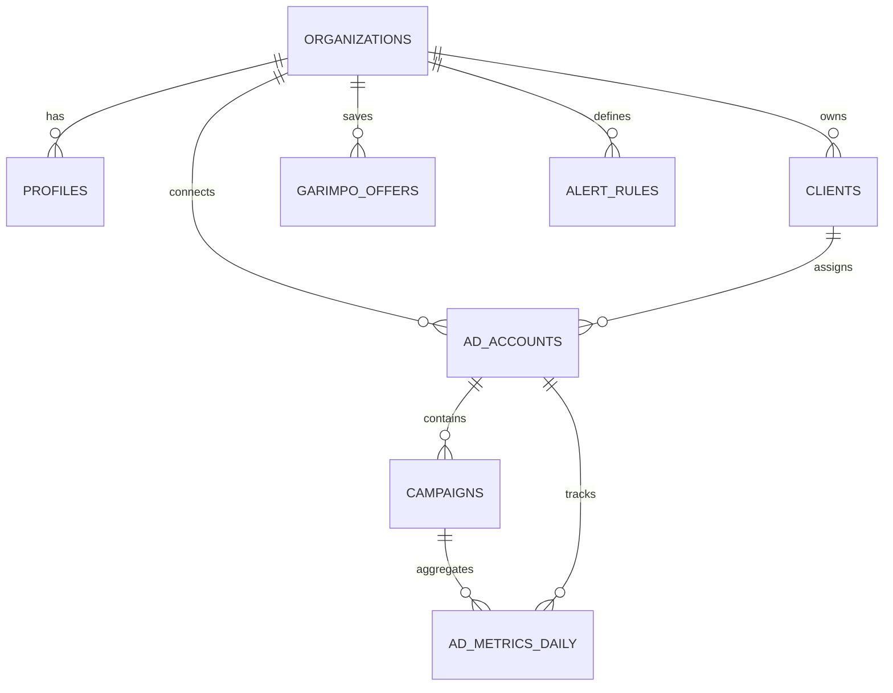

# SCHEMA.md — Start Metric Database Architecture

> **Fonte Canônica de Banco de Dados do Start Metric (PostgreSQL / Supabase).**
> Define todas as tabelas, tipos de dados, chaves primárias, estrangeiras, índices de alta performance e políticas de segurança RLS (Row Level Security).

---

## 🗄️ 1. Diagrama de Relacionamento de Entidades (ERD)



---

## 🏗️ 2. Definição das Tabelas DDL

```sql
-- Habilitar extensões necessárias
CREATE EXTENSION IF NOT EXISTS "uuid-ossp";
CREATE EXTENSION IF NOT EXISTS "pgcrypto";

-- ============================================================================
-- 1. ORGANIZAÇÕES (Multi-Tenancy Root)
-- ============================================================================
CREATE TABLE organizations (
    id UUID PRIMARY KEY DEFAULT gen_random_uuid(),
    name VARCHAR(255) NOT NULL,
    slug VARCHAR(100) UNIQUE NOT NULL,
    plan VARCHAR(50) DEFAULT 'pro' CHECK (plan IN ('starter', 'pro', 'agency', 'enterprise')),
    settings JSONB DEFAULT '{}'::jsonb,
    created_at TIMESTAMPTZ DEFAULT NOW() NOT NULL,
    updated_at TIMESTAMPTZ DEFAULT NOW() NOT NULL
);

-- ============================================================================
-- 2. USUÁRIOS & PERFIS
-- ============================================================================
CREATE TABLE profiles (
    id UUID PRIMARY KEY REFERENCES auth.users(id) ON DELETE CASCADE,
    organization_id UUID NOT NULL REFERENCES organizations(id) ON DELETE CASCADE,
    full_name VARCHAR(255),
    email VARCHAR(255) NOT NULL,
    role VARCHAR(50) DEFAULT 'member' CHECK (role IN ('owner', 'admin', 'member')),
    avatar_url TEXT,
    created_at TIMESTAMPTZ DEFAULT NOW() NOT NULL,
    updated_at TIMESTAMPTZ DEFAULT NOW() NOT NULL
);

-- ============================================================================
-- 3. CLIENTES DA AGÊNCIA (CRM de Gestão de Tráfego)
-- ============================================================================
CREATE TABLE clients (
    id UUID PRIMARY KEY DEFAULT gen_random_uuid(),
    organization_id UUID NOT NULL REFERENCES organizations(id) ON DELETE CASCADE,
    name VARCHAR(255) NOT NULL,
    niche VARCHAR(100) NOT NULL, -- 'Infoproduto', 'E-commerce', 'Negócio Local', 'SaaS', 'Saúde & Estética'
    whatsapp_number VARCHAR(30),
    monthly_budget NUMERIC(12,2) DEFAULT 0.00,
    target_cpa NUMERIC(10,2) DEFAULT 0.00,
    target_roas NUMERIC(6,2) DEFAULT 0.00,
    status VARCHAR(30) DEFAULT 'active' CHECK (status IN ('active', 'paused', 'churned')),
    notes TEXT,
    created_at TIMESTAMPTZ DEFAULT NOW() NOT NULL,
    updated_at TIMESTAMPTZ DEFAULT NOW() NOT NULL
);

-- ============================================================================
-- 4. CONTAS DE ANÚNCIOS META ADS
-- ============================================================================
CREATE TABLE ad_accounts (
    id UUID PRIMARY KEY DEFAULT gen_random_uuid(),
    organization_id UUID NOT NULL REFERENCES organizations(id) ON DELETE CASCADE,
    client_id UUID REFERENCES clients(id) ON DELETE SET NULL,
    meta_account_id VARCHAR(100) NOT NULL UNIQUE, -- 'act_123456789'
    account_name VARCHAR(255) NOT NULL,
    access_token TEXT NOT NULL, -- Token de longa duração (AES-256 encrypted)
    token_expires_at TIMESTAMPTZ,
    currency VARCHAR(10) DEFAULT 'BRL',
    timezone_name VARCHAR(100) DEFAULT 'America/Sao_Paulo',
    status VARCHAR(50) DEFAULT 'ACTIVE',
    last_synced_at TIMESTAMPTZ,
    created_at TIMESTAMPTZ DEFAULT NOW() NOT NULL
);

-- ============================================================================
-- 5. CAMPANHAS
-- ============================================================================
CREATE TABLE campaigns (
    id UUID PRIMARY KEY DEFAULT gen_random_uuid(),
    ad_account_id UUID NOT NULL REFERENCES ad_accounts(id) ON DELETE CASCADE,
    meta_campaign_id VARCHAR(100) NOT NULL UNIQUE,
    name VARCHAR(255) NOT NULL,
    objective VARCHAR(100),
    status VARCHAR(50) NOT NULL, -- 'ACTIVE', 'PAUSED', 'ARCHIVED'
    daily_budget NUMERIC(12,2),
    lifetime_budget NUMERIC(12,2),
    created_at TIMESTAMPTZ DEFAULT NOW() NOT NULL,
    updated_at TIMESTAMPTZ DEFAULT NOW() NOT NULL
);

-- ============================================================================
-- 6. MÉTRICAS DIÁRIAS (Insights & Desempenho)
-- ============================================================================
CREATE TABLE ad_metrics_daily (
    id UUID PRIMARY KEY DEFAULT gen_random_uuid(),
    ad_account_id UUID NOT NULL REFERENCES ad_accounts(id) ON DELETE CASCADE,
    campaign_id UUID REFERENCES campaigns(id) ON DELETE CASCADE,
    ad_id VARCHAR(100),
    date DATE NOT NULL,
    spend NUMERIC(12,2) DEFAULT 0.00,
    impressions INT DEFAULT 0,
    clicks INT DEFAULT 0,
    cpc NUMERIC(10,2) DEFAULT 0.00,
    ctr NUMERIC(6,4) DEFAULT 0.00,
    conversions INT DEFAULT 0,
    conversion_value NUMERIC(12,2) DEFAULT 0.00,
    cpa NUMERIC(10,2) DEFAULT 0.00,
    roas NUMERIC(8,2) DEFAULT 0.00,
    leads INT DEFAULT 0,
    cost_per_lead NUMERIC(10,2) DEFAULT 0.00,
    created_at TIMESTAMPTZ DEFAULT NOW() NOT NULL,
    UNIQUE(ad_account_id, campaign_id, ad_id, date)
);

-- ============================================================================
-- 7. OFERTAS DO GARIMPO & BIBLIOTECA
-- ============================================================================
CREATE TABLE garimpo_offers (
    id UUID PRIMARY KEY DEFAULT gen_random_uuid(),
    organization_id UUID NOT NULL REFERENCES organizations(id) ON DELETE CASCADE,
    title VARCHAR(255) NOT NULL,
    niche VARCHAR(100) NOT NULL,
    platform VARCHAR(50) NOT NULL, -- 'Meta', 'TikTok', 'YouTube', 'Spy'
    creative_url TEXT,
    thumbnail_url TEXT,
    copy_text TEXT,
    estimated_scale VARCHAR(50) DEFAULT 'Média', -- 'Baixa', 'Média', 'Escala Máxima'
    landing_page_url TEXT,
    status VARCHAR(50) DEFAULT 'ideation' CHECK (status IN ('ideation', 'testing', 'validated', 'scaling')),
    notes TEXT,
    created_at TIMESTAMPTZ DEFAULT NOW() NOT NULL
);

-- ============================================================================
-- 8. REGRAS DE ALERTAS INTELIGENTES
-- ============================================================================
CREATE TABLE alert_rules (
    id UUID PRIMARY KEY DEFAULT gen_random_uuid(),
    organization_id UUID NOT NULL REFERENCES organizations(id) ON DELETE CASCADE,
    ad_account_id UUID REFERENCES ad_accounts(id) ON DELETE CASCADE,
    name VARCHAR(255) NOT NULL,
    metric VARCHAR(50) NOT NULL, -- 'cpa', 'roas', 'spend_without_conversion'
    condition VARCHAR(10) NOT NULL, -- '>', '<', '>='
    threshold NUMERIC(10,2) NOT NULL,
    action VARCHAR(50) DEFAULT 'notify_whatsapp',
    is_active BOOLEAN DEFAULT TRUE,
    created_at TIMESTAMPTZ DEFAULT NOW() NOT NULL
);
```

---

## ⚡ 3. Índices de Alta Performance (Sub-5ms)

```sql
-- Agregação e séries temporais de métricas
CREATE INDEX idx_ad_metrics_account_date ON ad_metrics_daily(ad_account_id, date DESC);
CREATE INDEX idx_ad_metrics_campaign_date ON ad_metrics_daily(campaign_id, date DESC);

-- Busca rápida de campanhas ativas
CREATE INDEX idx_campaigns_account_status ON campaigns(ad_account_id, status);

-- Isolamento multi-tenant
CREATE INDEX idx_clients_org_status ON clients(organization_id, status);
CREATE INDEX idx_garimpo_org_niche ON garimpo_offers(organization_id, niche);
CREATE INDEX idx_ad_accounts_org ON ad_accounts(organization_id);
```

---

## 🛡️ 4. Políticas RLS (Row Level Security)

```sql
ALTER TABLE organizations ENABLE ROW LEVEL SECURITY;
ALTER TABLE profiles ENABLE ROW LEVEL SECURITY;
ALTER TABLE clients ENABLE ROW LEVEL SECURITY;
ALTER TABLE ad_accounts ENABLE ROW LEVEL SECURITY;
ALTER TABLE campaigns ENABLE ROW LEVEL SECURITY;
ALTER TABLE ad_metrics_daily ENABLE ROW LEVEL SECURITY;
ALTER TABLE garimpo_offers ENABLE ROW LEVEL SECURITY;
ALTER TABLE alert_rules ENABLE ROW LEVEL SECURITY;

-- Helper function para obter organization_id do usuário logado
CREATE OR REPLACE FUNCTION get_current_user_org_id()
RETURNS UUID AS $$
  SELECT organization_id FROM profiles WHERE id = auth.uid() LIMIT 1;
$$ LANGUAGE sql SECURITY DEFINER;

-- Regra padrão para leitura isolada por organização
CREATE POLICY "Users can only access data of their organization" 
ON clients FOR ALL 
USING (organization_id = get_current_user_org_id());

CREATE POLICY "Users can only access ad accounts of their organization" 
ON ad_accounts FOR ALL 
USING (organization_id = get_current_user_org_id());

CREATE POLICY "Users can only access garimpo offers of their organization" 
ON garimpo_offers FOR ALL 
USING (organization_id = get_current_user_org_id());
```
